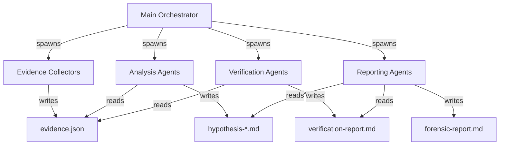
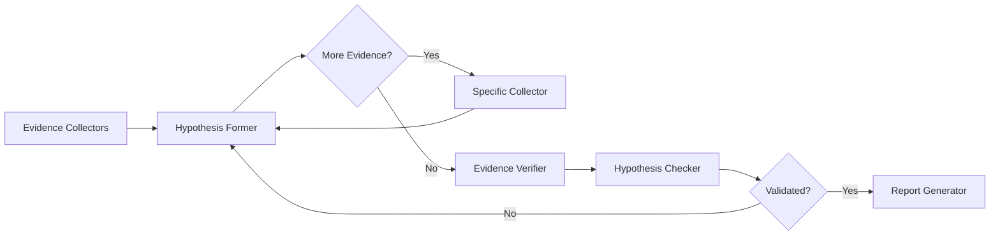

## Overview

RAPTOR uses multi-agent orchestration to coordinate specialized AI agents that work together on complex security analysis tasks. Each agent has a specific role, skills, and tools.

<CardGroup cols={2}>
  <Card title="17 Specialized Agents" icon="users">
    Purpose-built agents for evidence collection, analysis, verification, and reporting
  </Card>
  <Card title="Sequential & Parallel Execution" icon="code-branch">
    Run agents in parallel for efficiency or sequentially when dependencies exist
  </Card>
  <Card title="Agent Communication" icon="comments">
    Agents communicate through shared files and structured data formats
  </Card>
  <Card title="Workflow Orchestration" icon="sitemap">
    Main orchestrator manages agent lifecycle and coordinates complex workflows
  </Card>
</CardGroup>

## Architecture



### Orchestrator Responsibilities

<Steps>
  <Step title="Agent Spawning">
    The orchestrator is the **ONLY** component that spawns agents. Agents never spawn other agents.
  </Step>
  
  <Step title="Workflow Coordination">
    Manages phase transitions and ensures agents run in correct order with proper dependencies.
  </Step>
  
  <Step title="Data Passing">
    Provides working directory path to all agents for shared file access.
  </Step>
  
  <Step title="Error Handling">
    Catches agent failures, implements retry logic, and handles graceful degradation.
  </Step>
</Steps>

## Agent Types

### Evidence Collection Agents

These agents collect forensic evidence from different sources and write to the shared evidence store.

<AccordionGroup>
  <Accordion title="oss-investigator-gh-archive-agent" icon="database">
    **Purpose:** Query GitHub Archive via BigQuery for tamper-proof event data
    
    **Skills:** `github-archive`, `github-evidence-kit`
    
    **Collects:**
    - PushEvent (commits pushed)
    - PullRequestEvent (PRs opened/closed/merged)
    - IssuesEvent (issues opened/closed)
    - CreateEvent/DeleteEvent (branches/tags created/deleted)
    - WorkflowRunEvent (GitHub Actions runs)
    
    **Output:** Writes events to `evidence.json`
    
    **Invocation:**
    ```python
    Task: oss-investigator-gh-archive-agent
      Prompt: "Collect evidence from GH Archive for <research question>.
               Working directory: <workdir>
               Targets: repos=<repos>, actors=<actors>, dates=<dates>"
    ```
  </Accordion>
  
  <Accordion title="oss-investigator-github-agent" icon="github">
    **Purpose:** Query live GitHub API for current repository state
    
    **Skills:** `github-evidence-kit`
    
    **Collects:**
    - Commit content and metadata
    - File contents at specific refs
    - Branch and tag information
    - PR and issue details (if not deleted)
    - Fork relationships
    
    **Output:** Writes observations to `evidence.json`
    
    **Use Case:** Retrieve commit content after getting SHA from GH Archive
  </Accordion>
  
  <Accordion title="oss-investigator-wayback-agent" icon="clock-rotate-left">
    **Purpose:** Recover deleted content from Wayback Machine
    
    **Skills:** `github-wayback-recovery`, `github-evidence-kit`
    
    **Collects:**
    - Archived README and documentation
    - Deleted issue/PR content
    - Repository metadata snapshots
    - Wiki pages
    
    **Output:** Writes snapshots to `evidence.json`
    
    **Limitation:** Cannot recover private content or full git history
  </Accordion>
  
  <Accordion title="oss-investigator-local-git-agent" icon="code-branch">
    **Purpose:** Analyze cloned repositories for dangling commits
    
    **Skills:** `github-evidence-kit`
    
    **Collects:**
    - Dangling commits (not reachable from any ref)
    - Reflog entries
    - Force-pushed commit content
    
    **Output:** Writes commit observations to `evidence.json`
    
    **Value:** Reveals force-pushed or deleted commits that attackers tried to hide
  </Accordion>
  
  <Accordion title="oss-investigator-ioc-extractor-agent" icon="list-check">
    **Purpose:** Extract IOCs (Indicators of Compromise) from vendor security reports
    
    **Skills:** `github-evidence-kit`
    
    **Collects:**
    - Commit SHAs
    - File hashes
    - Usernames
    - Repository URLs
    - IP addresses and domains
    
    **Output:** Writes IOC observations to `evidence.json`
    
    **Invocation:** Only spawned if vendor report URL is in research question
  </Accordion>
</AccordionGroup>

### Analysis Agents

These agents analyze collected evidence and form hypotheses about security incidents.

<AccordionGroup>
  <Accordion title="oss-hypothesis-former-agent" icon="lightbulb">
    **Purpose:** Analyze evidence and form hypotheses OR request additional evidence
    
    **Skills:** `github-evidence-kit`
    
    **Input:** Reads `evidence.json`, previous rebuttal (if retry)
    
    **Output:** Writes either:
    - `evidence-request-{N}.md` if more evidence needed
    - `hypothesis-{N}.md` if evidence sufficient
    
    **Key Behavior:** Can request specific follow-up investigations:
    
    ```markdown
    # Evidence Request 001
    
    ## Missing Evidence
    - **Need**: PushEvents for actor 'user' on 2025-07-13
    - **Agent**: oss-investigator-gh-archive-agent
    - **Query**: "Query PushEvents where actor.login='user'"
    
    ## Reason
    Cannot determine timeline without push events.
    ```
    
    **Hypothesis Format:**
    - Research question restatement
    - Executive summary
    - Timeline table with evidence citations
    - Attribution with confidence levels
    - Intent analysis (evidence-based)
    - Impact assessment
    - Evidence citations table
  </Accordion>
  
  <Accordion title="oss-hypothesis-checker-agent" icon="clipboard-check">
    **Purpose:** Validate hypothesis claims against verified evidence
    
    **Skills:** `github-evidence-kit`
    
    **Input:** Reads `hypothesis-{N}.md` and `evidence.json`
    
    **Output:** Writes either:
    - `hypothesis-{N}-confirmed.md` if all claims validated
    - `hypothesis-{N}-rebuttal.md` if claims fail verification
    
    **Validation Rules:**
    - Every claim must cite evidence by ID
    - Evidence IDs must exist in store with verified status
    - Attribution confidence must match evidence quality
    - Timeline must use exact UTC timestamps from evidence
    - No speculation or unsupported claims
    
    **Rebuttal Format:**
    ```markdown
    # Hypothesis Rebuttal
    
    ## Issues Found
    1. Claim "attacker created tag at 19:41" has no evidence citation
    2. Evidence [EVD-003] cited but not in evidence store
    3. Attribution confidence "HIGH" but only one source
    
    ## Required Fixes
    - Add evidence citation for tag creation claim
    - Remove or verify [EVD-003]
    - Reduce confidence to MEDIUM or add corroborating source
    ```
  </Accordion>
  
  <Accordion title="crash-analyzer-agent" icon="bug">
    **Purpose:** Deep root-cause analysis of C/C++ crashes using rr debugger
    
    **Skills:** `rr-debugger`, `function-tracing`, `gcov-coverage`
    
    **Input:** Bug tracker URL, git repo URL
    
    **Output:** Root cause analysis with:
    - Crash location and stack trace
    - Function call sequence leading to crash
    - Code coverage data
    - Memory state at crash point
    
    **Workflow:** Deterministic replay debugging with rr
  </Accordion>
  
  <Accordion title="crash-analyzer-checker-agent" icon="magnifying-glass">
    **Purpose:** Validate crash analysis accuracy
    
    **Input:** Crash analysis report
    
    **Output:** Verification report with:
    - Claim validation results
    - Code path verification
    - Alternative explanations (if any)
    
    **Method:** Re-executes traces and checks coverage data
  </Accordion>
  
  <Accordion title="exploitability-validator-agent" icon="shield-halved">
    **Purpose:** Determine if vulnerabilities are exploitable
    
    **Skills:** `exploitability-validation`
    
    **Input:** SARIF findings, target binary path
    
    **Output:** Validation report with:
    - Reachability analysis
    - Exploit feasibility assessment
    - Mitigation effectiveness check
    
    **Stages:** 0 (Inventory) → A (One-Shot) → B (Process) → C (Sanity) → D (Ruling) → E (Feasibility)
  </Accordion>
</AccordionGroup>

### Verification Agents

<AccordionGroup>
  <Accordion title="oss-evidence-verifier-agent" icon="shield-check">
    **Purpose:** Re-verify all collected evidence against original sources
    
    **Skills:** `github-evidence-kit`
    
    **Input:** Reads `evidence.json`
    
    **Output:** Writes `evidence-verification-report.md`
    
    **Verification Process:**
    
    ```python
    from src import EvidenceStore
    from src.verifiers import ConsistencyVerifier
    
    store = EvidenceStore.load(f"{workdir}/evidence.json")
    verifier = ConsistencyVerifier()
    
    results = verifier.verify_all(store.get_all())
    
    # Report includes:
    # - Total evidence count
    # - Verified count
    # - Failed verifications with reasons
    # - Unverifiable evidence (source unavailable)
    ```
    
    **Verification Methods:**
    - **GH Archive**: Re-query BigQuery with same parameters
    - **GitHub API**: Re-fetch from API endpoints
    - **Wayback**: Re-check snapshot availability
    - **Local Git**: Re-validate commit existence
  </Accordion>
</AccordionGroup>

### Reporting Agents

<AccordionGroup>
  <Accordion title="oss-report-generator-agent" icon="file-lines">
    **Purpose:** Generate final forensic report from confirmed hypothesis
    
    **Skills:** `github-evidence-kit`
    
    **Input:** Reads:
    - `hypothesis-{N}-confirmed.md`
    - `evidence.json`
    - `evidence-verification-report.md`
    
    **Output:** Writes `forensic-report.md`
    
    **Report Sections:**
    1. Executive Summary
    2. Timeline (chronological with evidence)
    3. Attribution (actors, confidence, evidence)
    4. Intent Analysis
    5. Impact Assessment
    6. IOCs (Indicators of Compromise)
    7. Evidence Appendix (full details)
  </Accordion>
</AccordionGroup>

## Execution Modes

### Parallel Execution

**Use When:** Agents have no dependencies on each other's outputs

**Pattern:** Spawn multiple agents in a **single message**

```python
# CORRECT: Single message with multiple Task calls
Task: oss-investigator-gh-archive-agent
  Prompt: "Collect from GH Archive..."
  
Task: oss-investigator-github-agent
  Prompt: "Collect from GitHub API..."
  
Task: oss-investigator-wayback-agent
  Prompt: "Collect from Wayback..."
  
Task: oss-investigator-local-git-agent
  Prompt: "Analyze local repo..."
```

**Benefit:** 4x faster than sequential execution for evidence collection phase

<Warning>
**Common Mistake:** Spawning agents in separate messages

```python
# WRONG: Separate messages (runs sequentially)
message 1: spawn oss-investigator-gh-archive-agent
message 2: spawn oss-investigator-github-agent
message 3: spawn oss-investigator-wayback-agent
```

This defeats the purpose of parallelization!
</Warning>

### Sequential Execution

**Use When:** Agent B depends on Agent A's output

**Pattern:** Wait for completion before next spawn

```python
# Phase 3: Hypothesis Formation
result1 = spawn_agent("oss-hypothesis-former-agent")
# Wait for completion and check output

if evidence_request_exists:
    # Phase 3b: Follow-up Evidence Collection
    result2 = spawn_agent("oss-investigator-gh-archive-agent", query=request)
    # Wait for completion
    
    # Phase 3c: Retry Hypothesis Formation
    result3 = spawn_agent("oss-hypothesis-former-agent")
```

**Dependencies Example:**



## Agent Communication

### Shared File System

Agents communicate through files in the working directory:

```bash
.out/oss-forensics-20250713-143022/
├── evidence.json              # Shared evidence store
├── evidence-request-001.md    # Hypothesis former → Orchestrator
├── hypothesis-001.md          # Hypothesis former → Checker
├── hypothesis-001-rebuttal.md # Checker → Hypothesis former
├── hypothesis-002.md          # Revised hypothesis
├── hypothesis-002-confirmed.md # Checker → Report generator
├── evidence-verification-report.md # Verifier → Report generator
└── forensic-report.md         # Final output
```

### Data Formats

**Evidence Store (JSON):**

```json
{
  "evidence": [
    {
      "evidence_id": "evt-001",
      "type": "PushEvent",
      "observed_when": "2025-07-13T20:30:24Z",
      "observed_by": "gharchive",
      "observed_what": "Commit pushed to main branch",
      "verification": {
        "source": "gharchive",
        "url": "bigquery://githubarchive.day.20250713",
        "verified_at": "2025-07-14T10:15:33Z"
      },
      "payload": { /* full event data */ }
    }
  ]
}
```

**Agent Communication Pattern:**

<Steps>
  <Step title="Write">
    Agent A writes structured data to shared file
  </Step>
  
  <Step title="Signal">
    Agent A completes and returns to orchestrator
  </Step>
  
  <Step title="Orchestrator Checks">
    Orchestrator checks for expected output files
  </Step>
  
  <Step title="Read">
    Agent B reads shared file created by Agent A
  </Step>
</Steps>

## Error Handling

### Agent Failure Strategies

<Tabs>
  <Tab title="Retry">
    **When:** Transient errors (network, API rate limits)
    
    ```python
    max_retries = 3
    for attempt in range(max_retries):
        try:
            result = spawn_agent("oss-investigator-github-agent", ...)
            break
        except Exception as e:
            if attempt < max_retries - 1:
                time.sleep(2 ** attempt)  # Exponential backoff
            else:
                logger.error(f"Agent failed after {max_retries} attempts")
    ```
  </Tab>
  
  <Tab title="Fallback">
    **When:** Primary data source unavailable, alternative exists
    
    ```python
    try:
        # Try GitHub API first
        result = spawn_agent("oss-investigator-github-agent", ...)
    except Exception:
        # Fall back to Wayback Machine
        result = spawn_agent("oss-investigator-wayback-agent", ...)
    ```
  </Tab>
  
  <Tab title="Graceful Degradation">
    **When:** Non-critical agent fails
    
    ```python
    try:
        # Try to get IOCs from vendor report
        spawn_agent("oss-investigator-ioc-extractor-agent", ...)
    except Exception as e:
        logger.warning(f"IOC extraction failed: {e}")
        # Continue investigation without IOCs
        pass
    ```
  </Tab>
  
  <Tab title="Fail Fast">
    **When:** Critical prerequisite missing (e.g., BigQuery credentials)
    
    ```python
    if not os.getenv("GOOGLE_APPLICATION_CREDENTIALS"):
        raise RuntimeError(
            "BigQuery credentials required. "
            "Set GOOGLE_APPLICATION_CREDENTIALS environment variable."
        )
    ```
  </Tab>
</Tabs>

### Error Recovery Workflow

```python
def orchestrate_with_recovery():
    try:
        # Phase 2: Parallel evidence collection
        results = spawn_parallel_agents([
            "oss-investigator-gh-archive-agent",
            "oss-investigator-github-agent",
            "oss-investigator-wayback-agent",
        ])
        
        # Check which agents succeeded
        successful = [r for r in results if r.success]
        failed = [r for r in results if not r.success]
        
        if len(successful) == 0:
            raise RuntimeError("All evidence collection failed")
        
        if failed:
            logger.warning(f"{len(failed)} agents failed, continuing with available evidence")
        
        # Phase 3: Hypothesis formation (proceeds with available evidence)
        spawn_agent("oss-hypothesis-former-agent", ...)
        
    except Exception as e:
        logger.error(f"Orchestration failed: {e}")
        generate_partial_report()
```

## Best Practices

<CardGroup cols={2}>
  <Card title="Spawn Parallel When Possible" icon="forward-fast">
    Evidence collectors have no dependencies - always spawn in parallel for 4-5x speedup
  </Card>
  
  <Card title="Single Responsibility" icon="bullseye">
    Each agent does ONE thing well. Don't ask evidence collectors to form hypotheses.
  </Card>
  
  <Card title="Pass Working Directory" icon="folder">
    Every agent needs the working directory path to read/write shared files
  </Card>
  
  <Card title="Verify Outputs" icon="check-double">
    Orchestrator should check that expected output files exist before proceeding
  </Card>
</CardGroup>

### Agent Design Principles

<AccordionGroup>
  <Accordion title="Agents Never Spawn Other Agents">
    Only the orchestrator spawns agents. This prevents infinite loops and makes workflows debuggable.
  </Accordion>
  
  <Accordion title="Skills Define Capabilities">
    Agents declare their skills (e.g., `github-archive`, `github-evidence-kit`). Skills are documentation loaded into agent context.
  </Accordion>
  
  <Accordion title="Tools Define Actions">
    Agents declare their tools (e.g., `Bash`, `Read`, `Write`). Tools are actual capabilities the agent can use.
  </Accordion>
  
  <Accordion title="File-Based Communication">
    Agents communicate through files, not return values. This makes workflows resumable and debuggable.
  </Accordion>
</AccordionGroup>

## Performance Optimization

### Parallelization Impact

**Evidence Collection Phase:**

| Execution Mode | Time | Speedup |
|----------------|------|----------|
| Sequential (4 agents) | 120s | 1x |
| Parallel (4 agents) | 30s | **4x** |

**Why Parallel Works:**
- GH Archive agent: Waits for BigQuery
- GitHub API agent: Waits for API responses
- Wayback agent: Waits for Archive.org
- Local Git agent: Waits for git commands

All are I/O-bound, not CPU-bound!

### Orchestrator Optimization

```python
# ❌ BAD: Spawn agents one at a time
for agent in ["agent1", "agent2", "agent3"]:
    spawn_agent(agent)
    # Total time: 30s + 30s + 30s = 90s

# ✅ GOOD: Spawn all agents in parallel
spawn_parallel_agents(["agent1", "agent2", "agent3"])
# Total time: max(30s, 30s, 30s) = 30s
```

## Debugging

### Workflow Tracing

Enable detailed orchestrator logging:

```bash
export RAPTOR_LOG_LEVEL=DEBUG
/oss-forensics "your question"
```

**Log Output:**
```
[ORCHESTRATOR] Phase 0: Initialize → workdir created
[ORCHESTRATOR] Phase 1: Parse prompt → repo=aws/aws-toolkit-vscode, actor=lkmanka58
[ORCHESTRATOR] Phase 2: Spawn 4 investigators in parallel
[AGENT] oss-investigator-gh-archive-agent → started
[AGENT] oss-investigator-github-agent → started
[AGENT] oss-investigator-wayback-agent → started
[AGENT] oss-investigator-local-git-agent → started
[AGENT] oss-investigator-gh-archive-agent → completed (42 events)
[AGENT] oss-investigator-github-agent → completed (5 commits)
[AGENT] oss-investigator-wayback-agent → failed (no snapshots)
[AGENT] oss-investigator-local-git-agent → completed (2 dangling commits)
[ORCHESTRATOR] Phase 3: Spawn hypothesis former
```

### Common Issues

<ResponseField name="Agent spawns but produces no output" type="error">
  **Cause:** Agent completed but didn't write expected output file
  
  **Debug:**
  ```bash
  ls -la .out/oss-forensics-*/
  # Check if evidence.json, hypothesis-*.md, etc. exist
  ```
  
  **Fix:** Check agent logs for errors during file write
</ResponseField>

<ResponseField name="Parallel agents run sequentially" type="warning">
  **Cause:** Agents spawned in separate messages instead of single message
  
  **Fix:** Use single message with multiple Task calls
</ResponseField>

<ResponseField name="Evidence store grows unbounded" type="info">
  **Expected behavior** - evidence accumulates across investigation
  
  **If concern:** Evidence is deduplicated by ID, so duplicates don't inflate size
</ResponseField>

## Further Reading

<CardGroup cols={2}>
  <Card title="Agent Definitions" icon="file-code" href="https://github.com">
    Full agent specifications with skills and tools
  </Card>
  <Card title="Orchestrator Code" icon="gears" href="https://github.com">
    Source code for workflow orchestration logic
  </Card>
  <Card title="Evidence Kit API" icon="box" href="https://github.com">
    Python API for evidence collection and storage
  </Card>
  <Card title="Creating Custom Agents" icon="plus" href="https://github.com">
    Guide to building your own specialized agents
  </Card>
</CardGroup>