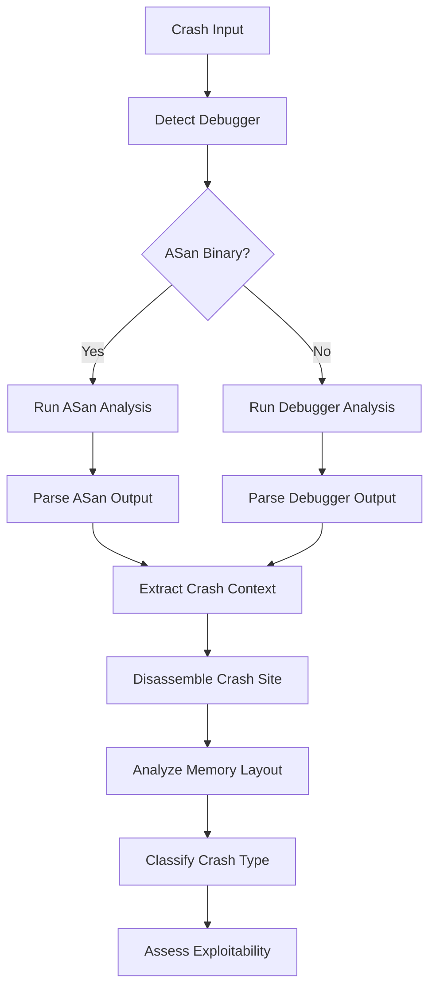

## Overview

RAPTOR provides autonomous crash analysis for C/C++ binaries using debugger integration and deterministic replay. The system extracts crash context, classifies vulnerability types, and assesses exploitability.

<Note>
Crash analysis combines debugger traces, disassembly, memory layout analysis, and symbol resolution for comprehensive crash understanding.
</Note>

## Features

- **Multi-Debugger Support**: Automatic detection of GDB or LLDB
- **ASan Integration**: Enhanced diagnostics for sanitizer-instrumented binaries
- **rr Replay**: Deterministic debugging with reverse execution
- **Function Tracing**: Call trace visualization with Perfetto
- **Crash Classification**: Automatic vulnerability type detection
- **Memory Analysis**: Region identification and protection status

## Crash Analysis Workflow



## Crash Context Extraction

The analyzer extracts comprehensive crash information:

```python
@dataclass
class CrashContext:
    """Complete context for a crash."""
    crash_id: str
    binary_path: Path
    input_file: Path
    signal: str
    
    # From debugger
    stack_trace: str = ""
    registers: Dict[str, str] = field(default_factory=dict)
    crash_instruction: str = ""
    crash_address: str = ""
    stack_hash: str = ""  # For deduplication
    
    # From disassembly
    disassembly: str = ""
    function_name: str = "unknown"
    source_location: str = ""  # file:line
    
    # Binary information
    binary_info: Dict[str, str] = field(default_factory=dict)
    
    # Analysis results
    exploitability: str = "unknown"
    crash_type: str = "unknown"
    cvss_estimate: float = 0.0
```

## Debugger Integration

### GDB Analysis

For Linux binaries and general debugging:

```python
def _run_gdb_analysis(self, input_file: Path) -> str:
    """Run GDB to analyze crash."""
    gdb_commands = [
        "set pagination off",
        "set confirm off",
        "set print pretty on",
        "handle SIGSEGV stop",
        "handle SIGABRT stop",
        f"run < '{input_file}'",
        "info registers",
        "backtrace full",
        "x/10i $pc",  # Disassemble at crash
        "x/20xw $sp", # Examine stack
        "quit",
    ]
    
    result = subprocess.run(
        ["gdb", "-batch", "-x", cmd_file, str(self.binary)],
        capture_output=True,
        timeout=30
    )
    return result.stdout
```

### LLDB Analysis

For macOS binaries (Mach-O format):

```python
def _run_lldb_analysis(self, input_file: Path) -> str:
    """Run LLDB to analyze crash (macOS)."""
    lldb_commands = [
        "settings set auto-confirm true",
        "process handle SIGSEGV -s true",
        f"process launch -i {input_file}",
        "register read",
        "thread backtrace --extended true",
        "disassemble --count 10 --start-address $pc",
        "memory read --size 4 --format x --count 20 $sp",
        "quit",
    ]
    
    result = subprocess.run(
        ["lldb", "-s", cmd_file, str(self.binary)],
        capture_output=True,
        timeout=60
    )
    return result.stdout
```

## ASan Integration

<Tip>
AddressSanitizer provides superior crash diagnostics - always use ASan builds when available.
</Tip>

### Detection

```python
def _detect_asan_binary(self) -> bool:
    """Detect if binary was compiled with AddressSanitizer."""
    result = subprocess.run(
        ["nm", str(self.binary)],
        capture_output=True,
        text=True
    )
    
    asan_symbols = [
        "__asan_", "__sanitizer", 
        "__asan_report", "__asan_handle"
    ]
    
    for symbol in asan_symbols:
        if symbol in result.stdout:
            return True
    return False
```

### ASan Output Parsing

ASan provides detailed diagnostics:

```
AddressSanitizer: heap-buffer-overflow on address 0x602000000015 at pc 0x00000040123c
READ of size 1 at 0x602000000015 thread T0
    #0 0x40123b in process_data /src/server.c:145
    #1 0x401456 in main /src/server.c:234

0x602000000015 is located 0 bytes to the right of 5-byte region [0x602000000010,0x602000000015)
allocated by thread T0 here:
    #0 0x7f8b4c in malloc (/lib/x86_64-linux-gnu/libasan.so.5+0x10c4c)
    #1 0x40115e in allocate_buffer /src/server.c:89
```

The analyzer extracts:
- Crash type (heap-buffer-overflow)
- Access type (READ)
- Crash address
- Stack trace
- Allocation trace

## rr Deterministic Debugging

<Note>
rr provides record-replay debugging with full reverse execution - critical for understanding complex crashes.
</Note>

### Recording a Crash

```bash
# Record execution
rr record ./vulnerable_program < crash_input.txt

# Replay with reverse execution
rr replay
```

### Reverse Execution Commands

Once in replay mode (GDB interface):

<Tabs>
  <Tab title="Regular Crashes">
    ```gdb
    # Go back 100 steps from crash
    reverse-next 100
    
    # Now step forward to see execution leading to crash
    next
    next
    print buffer
    x/20xb buffer
    ```
  </Tab>
  
  <Tab title="ASan Crashes">
    ```gdb
    # View stack trace
    bt
    
    # Go up to last application frame (before ASan runtime)
    up
    up
    up
    
    # Set breakpoint at that location
    break *$pc
    
    # Reverse to last app instruction before ASan
    reverse-continue
    
    # Now step forward
    next
    print *ptr
    ```
  </Tab>
</Tabs>

### Automated Trace Extraction

Use the crash trace script:

```bash
# Extract execution trace before crash
python scripts/crash_trace.py trace.rr

# Output: detailed execution log with register values
```

## Function Call Tracing

<Tip>
Visualize execution flow with function tracing and Perfetto UI.
</Tip>

### Setup

<Steps>
  <Step title="Build Instrumentation Library">
    ```bash
    gcc -c -fPIC trace_instrument.c -o trace_instrument.o
    gcc -shared trace_instrument.o -o libtrace.so -ldl -lpthread
    ```
  </Step>
  
  <Step title="Instrument Binary">
    Add to build:
    ```makefile
    CFLAGS += -finstrument-functions -g
    LDFLAGS += -L. -ltrace -ldl -lpthread
    ```
  </Step>
  
  <Step title="Run with Tracing">
    ```bash
    export LD_LIBRARY_PATH=.:$LD_LIBRARY_PATH
    ./program < crash_input.txt
    # Creates trace_<tid>.log files
    ```
  </Step>
  
  <Step title="Convert to Perfetto">
    ```bash
    ./trace_to_perfetto trace_*.log -o trace.json
    # Open trace.json at ui.perfetto.dev
    ```
  </Step>
</Steps>

### Trace Format

```
[seq] [timestamp] [dots] [ENTRY|EXIT!] function_name
[0] [1.000000000]  [ENTRY] main
[1] [1.000050000] . [ENTRY] process_request
[2] [1.000100000] .. [ENTRY] parse_input
[3] [1.000120000] ... [ENTRY] strcpy    ← Crashes here
```

Dots indicate call depth - easy to see execution path to crash.

## Crash Classification

Automatic classification based on signals and context:

```python
def classify_crash_type(self, context: CrashContext) -> str:
    """Classify crash type based on available information."""
    signal = context.signal.lower()
    
    if signal in ["11", "sigsegv"]:
        # Segmentation fault - analyze further
        memory_region = context.binary_info.get("memory_region", "")
        
        if "heap" in memory_region:
            return "heap_overflow"
        elif "stack" in memory_region:
            return "stack_overflow"
        elif context.crash_address in ["0x0", "0x00000000"]:
            return "null_pointer_dereference"
        else:
            return "memory_access_violation"
    
    elif signal in ["6", "sigabrt"]:
        if context.binary_info.get("asan_enabled") == "true":
            return "asan_detected_bug"
        elif "double free" in context.stack_trace.lower():
            return "double_free"
        else:
            return "abort_signal"
    
    # ... more classifications
```

### Crash Types

<CardGroup cols={2}>
  <Card title="Heap Overflow" icon="layer-group">
    Buffer overflow in heap-allocated memory
    
    **Indicators:**
    - Crash in malloc/free
    - ASan: heap-buffer-overflow
    - Memory region: heap
  </Card>
  
  <Card title="Stack Overflow" icon="bars-staggered">
    Buffer overflow on the stack
    
    **Indicators:**
    - Crash in strcpy/memcpy
    - Stack canary detection
    - Memory region: stack
  </Card>
  
  <Card title="Use-After-Free" icon="trash-clock">
    Access to freed memory
    
    **Indicators:**
    - ASan: heap-use-after-free
    - Crash in heap access
    - Invalid heap metadata
  </Card>
  
  <Card title="Double Free" icon="trash-xmark">
    Freeing memory twice
    
    **Indicators:**
    - SIGABRT in free()
    - ASan: double-free
    - Heap corruption
  </Card>
  
  <Card title="NULL Dereference" icon="circle-xmark">
    Dereferencing NULL pointer
    
    **Indicators:**
    - SIGSEGV at 0x0
    - PC at low address
    - NULL pointer in register
  </Card>
  
  <Card title="Format String" icon="percent">
    Format string vulnerability
    
    **Indicators:**
    - Crash in printf family
    - %n or %s in input
    - Abnormal format string
  </Card>
</CardGroup>

## Memory Region Analysis

Identify which memory region was accessed:

```python
def _analyze_memory_regions(self, context: CrashContext) -> Dict[str, str]:
    """Analyze memory regions around crash address."""
    crash_addr = int(context.crash_address, 16)
    
    # Null page
    if crash_addr < 0x1000:
        return {
            "memory_region": "null_page",
            "analysis": "Likely NULL pointer dereference"
        }
    
    # Linux mmap region
    elif crash_addr >= 0x7f0000000000:
        return {
            "memory_region": "mmap_region",
            "analysis": "Heap or library memory"
        }
    
    # Common PIE base
    elif crash_addr >= 0x555555554000:
        return {
            "memory_region": "pie_base",
            "analysis": "PIE executable code/data"
        }
    
    # Check proximity to stack
    sp = int(context.registers.get("rsp", "0"), 16)
    if abs(crash_addr - sp) < 0x10000:
        return {
            "memory_region": "stack",
            "relative_to_stack": "near_stack_pointer"
        }
```

## Exploitability Assessment

Assess whether crash is exploitable:

<Tabs>
  <Tab title="High Exploitability">
    **Stack Buffer Overflow:**
    - Overwrites return address
    - No stack canary
    - Controlled input size
    
    **Heap Overflow:**
    - Overwrites heap metadata
    - No heap hardening
    - Predictable allocation pattern
    
    **Format String:**
    - %n writes enabled
    - Attacker controls format string
    - Known binary base
  </Tab>
  
  <Tab title="Medium Exploitability">
    **Stack Overflow with Canary:**
    - Canary must be leaked first
    - Requires info leak primitive
    
    **Heap Overflow with Safe-Linking:**
    - Requires heap address leak
    - More complex exploitation
    
    **Use-After-Free:**
    - Requires heap feng shui
    - Moderate complexity
  </Tab>
  
  <Tab title="Low Exploitability">
    **NULL Dereference:**
    - mmap_min_addr prevents mapping NULL page
    - Usually just denial of service
    
    **Environmental Crash:**
    - Debugger artifact
    - Not exploitable in production
    
    **Sanitizer Detection:**
    - Caught before exploitation
    - Defense mechanism working
  </Tab>
</Tabs>

## Best Practices

<AccordionGroup>
  <Accordion title="Always Use ASan Builds">
    AddressSanitizer provides the best crash diagnostics:
    
    ```bash
    # Build with ASan
    gcc -fsanitize=address -g -O1 -fno-omit-frame-pointer source.c
    
    # Run and catch bugs
    ./program < crash_input.txt
    ```
    
    ASan detects:
    - Buffer overflows (stack and heap)
    - Use-after-free
    - Double-free
    - Memory leaks
  </Accordion>
  
  <Accordion title="Use rr for Complex Crashes">
    Record-replay helps understand non-deterministic crashes:
    
    ```bash
    # Record once
    rr record ./program
    
    # Replay infinitely
    rr replay  # Same execution every time
    ```
    
    Especially useful for:
    - Race conditions
    - Heap corruption
    - Complex state machines
  </Accordion>
  
  <Accordion title="Generate Core Dumps">
    Enable core dumps for post-mortem analysis:
    
    ```bash
    # Enable core dumps
    ulimit -c unlimited
    
    # Run program
    ./program
    
    # Analyze core
    gdb ./program core
    ```
  </Accordion>
  
  <Accordion title="Deduplicate Crashes">
    Use stack hashes to identify unique crashes:
    
    ```python
    # Stack hash for deduplication
    stack_hash = hashlib.sha256(
        '|'.join(function_names[:10]).encode()
    ).hexdigest()[:16]
    
    # Group by hash
    unique_crashes = defaultdict(list)
    for crash in all_crashes:
        unique_crashes[crash.stack_hash].append(crash)
    ```
  </Accordion>
</AccordionGroup>

## See Also

<CardGroup cols={2}>
  <Card title="Vulnerability Analysis" icon="magnifying-glass" href="/analysis/vulnerability-analysis">
    LLM-powered security analysis
  </Card>
  <Card title="Exploit Generation" icon="code" href="/analysis/exploit-generation">
    Generate exploit PoCs
  </Card>
</CardGroup>