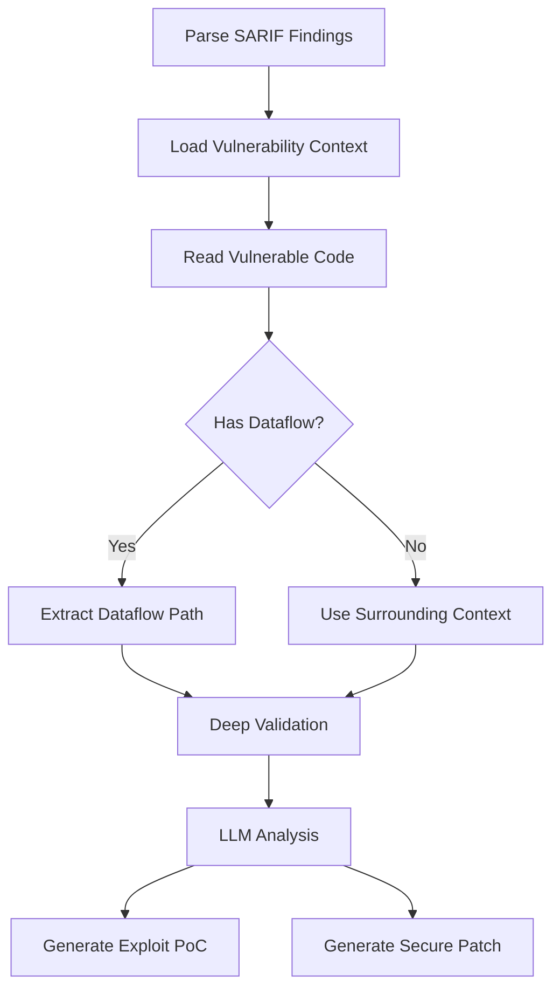

## Overview

RAPTOR provides truly autonomous security analysis powered by Large Language Models (LLMs). The system analyzes vulnerabilities with deep context awareness, including dataflow paths, sanitizer effectiveness, and exploitability assessment - with **no templates**.

<Note>
This is **autonomous analysis** - the LLM makes real security engineering decisions based on actual code, not pattern matching.
</Note>

## Key Features

- **LLM-Powered Analysis**: Claude, GPT-4, or local models (Ollama/DeepSeek/Qwen)
- **Dataflow Path Validation**: Tracks tainted data from source to sink
- **Sanitizer Bypass Detection**: Identifies ineffective or bypassable mitigations
- **Exploitability Scoring**: Rates vulnerability severity and feasibility
- **Cost Tracking**: Built-in budget management for API usage
- **Automatic Fallback**: Gracefully handles model failures

## Analysis Workflow

The autonomous agent follows this workflow:



### 1. Context Extraction

The agent automatically extracts full context for each vulnerability:

```python
class VulnerabilityContext:
    """Represents a vulnerability with full context for autonomous analysis."""
    
    def __init__(self, finding: Dict[str, Any], repo_path: Path):
        self.finding = finding
        self.rule_id = finding.get("rule_id")
        self.file_path = finding.get("file")
        self.start_line = finding.get("startLine")
        self.snippet = finding.get("snippet")
        
        # Dataflow analysis fields
        self.has_dataflow: bool = finding.get("has_dataflow", False)
        self.dataflow_source: Optional[Dict] = None
        self.dataflow_sink: Optional[Dict] = None
        self.sanitizers_found: List[str] = []
```

### 2. Dataflow Path Analysis

For vulnerabilities with dataflow paths, the agent traces data from source to sink:

<CodeGroup>
```python Source Detection
def extract_dataflow(self) -> bool:
    """Extract and enrich dataflow path information."""
    if not self.has_dataflow:
        return False
        
    # Extract source (where tainted data originates)
    if self.dataflow_path.get("source"):
        src = self.dataflow_path["source"]
        self.dataflow_source = {
            "file": src["file"],
            "line": src["line"],
            "label": src["label"],
            "code": self._read_code_at_location(src["file"], src["line"])
        }
```

```python Sanitizer Detection
# Extract intermediate steps (including sanitizers)
for step in self.dataflow_path.get("steps", []):
    is_sanitizer = self._is_sanitizer(step["label"])
    
    if is_sanitizer:
        self.sanitizers_found.append(step["label"])
        
    self.dataflow_steps.append({
        "file": step["file"],
        "line": step["line"],
        "label": step["label"],
        "is_sanitizer": is_sanitizer,
        "code": self._read_code_at_location(step["file"], step["line"])
    })
```
</CodeGroup>

### 3. Deep Validation

The LLM performs rigorous validation to separate real vulnerabilities from false positives:

<Steps>
  <Step title="Source Control Analysis">
    Is the data actually attacker-controlled?
    
    - HTTP request, user input, file upload → **Attacker controlled** ✓
    - Config file, environment variable → **Requires access first** ⚠️
    - Hardcoded constant, internal variable → **False positive** ✗
  </Step>
  
  <Step title="Sanitizer Effectiveness">
    Can the sanitizers be bypassed?
    
    - Analyze what each sanitizer actually does
    - Check for encoding bypasses (URL encoding, double encoding)
    - Verify coverage across all code paths
  </Step>
  
  <Step title="Reachability Analysis">
    Can an attacker trigger this code path?
    
    - Check for authentication/authorization barriers
    - Identify prerequisites that block exploitation
    - Verify the code is used in production
  </Step>
  
  <Step title="Exploitability Assessment">
    What's the actual risk?
    
    - Determine attack complexity (low/medium/high)
    - Identify required primitives and prerequisites
    - Estimate CVSS score (0.0-10.0)
  </Step>
</Steps>

## LLM Provider Support

### Anthropic Claude (Recommended)

<Tip>
Claude Sonnet 4.5 provides the best exploit generation quality and security analysis depth.
</Tip>

```bash
export ANTHROPIC_API_KEY=your_key
raptor scan --analyze
```

**Cost:** ~$0.003 per 1K input tokens, $0.015 per 1K output tokens

### OpenAI GPT-4

```bash
export OPENAI_API_KEY=your_key
raptor scan --analyze
```

**Cost:** ~$0.01 per 1K tokens

### Ollama (Local/Free)

<Warning>
**Important Limitations:**

- Vulnerability analysis and patching: **Works well** with Ollama models
- Exploit generation: **Requires frontier models** (Claude/GPT-4)
- Ollama models may generate invalid/non-compilable exploit code

For production-quality exploits, use Claude or GPT-4.
</Warning>

```bash
# Start Ollama server
ollama serve

# Pull a model
ollama pull deepseek-coder:33b

# Use with RAPTOR
raptor scan --analyze --model ollama/deepseek-coder:33b
```

**Supported Ollama Models:**
- `deepseek-coder:33b` - Best for code analysis
- `qwen2.5-coder:32b` - Strong at security tasks
- `codellama:70b` - Meta's code model

## Configuration

### LLM Config

The LLM client automatically handles model selection, fallback, and retry:

```python
from llm.config import LLMConfig

llm_config = LLMConfig()
llm_client = LLMClient(llm_config)

# Structured generation with schema validation
analysis, response = llm_client.generate_structured(
    prompt=prompt,
    schema=analysis_schema,
    system_prompt=system_prompt
)
```

### Cost Tracking

Built-in cost tracking for budget management:

```python
# Get statistics across all providers
llm_stats = llm_client.get_stats()

print(f"Total requests: {llm_stats['total_requests']}")
print(f"Total cost: ${llm_stats['total_cost']:.4f}")
print(f"Tokens used: {llm_stats['total_tokens']}")
```

## Analysis Output

### Structured Analysis

The LLM returns structured analysis with confidence scores:

```json
{
  "is_true_positive": true,
  "is_exploitable": true,
  "exploitability_score": 0.85,
  "severity_assessment": "high",
  "cvss_score_estimate": 7.5,
  
  "reasoning": "Buffer overflow in strcpy without bounds checking...",
  
  "attack_scenario": "Attacker can overflow stack buffer by sending...",
  "attack_complexity": "low",
  "prerequisites": ["Network access to service", "No authentication"],
  
  "impact": "Remote code execution with service privileges",
  
  "dataflow_analysis": {
    "source_attacker_controlled": true,
    "sanitizers_effective": false,
    "sanitizer_bypass_technique": "URL encoding bypasses filter"
  }
}
```

### Output Files

The agent saves detailed results:

```bash
.out/autonomous_v2_20260304_153000/
├── analysis/
│   ├── finding_001.json          # Detailed LLM analysis
│   ├── finding_002.json
│   └── ...
├── validation/
│   ├── finding_001_validation.json  # Dataflow validation
│   └── ...
├── exploits/
│   ├── finding_001_exploit.cpp   # Generated exploit PoCs
│   └── ...
├── patches/
│   ├── finding_001_patch.md      # Secure patches
│   └── ...
└── autonomous_analysis_report.json  # Summary report
```

## Budget Management

### Setting Budget Limits

<Warning>
LLM API calls can become expensive at scale. Set budgets to avoid surprises.
</Warning>

```python
# Limit cost per analysis
max_findings = 10  # Only analyze top 10 findings

agent = AutonomousSecurityAgentV2(
    repo_path=repo_path,
    out_dir=out_dir,
    llm_config=llm_config
)

report = agent.process_findings(
    sarif_paths,
    max_findings=max_findings
)
```

### Cost Estimates

**Per Vulnerability Analysis:**
- Context extraction: ~2K tokens
- Deep validation: ~4K tokens
- Exploit generation: ~6K tokens
- Patch generation: ~4K tokens

**Total per finding:** ~16K tokens (~$0.24 with Claude)

**For 100 findings:** ~$24

## Best Practices

<AccordionGroup>
  <Accordion title="Use Dataflow-Enabled Scanners">
    Scanners with dataflow support (CodeQL, Semgrep) provide much better context:
    
    - Source/sink tracking
    - Sanitizer detection
    - Intermediate transformation steps
    
    This enables the LLM to make better validation decisions.
  </Accordion>
  
  <Accordion title="Prioritize High-Severity Findings">
    Start with high-severity findings to maximize ROI:
    
    ```python
    # Sort findings by severity
    findings.sort(key=lambda f: f.get('level'), reverse=True)
    ```
  </Accordion>
  
  <Accordion title="Review LLM Decisions">
    The LLM is very good but not infallible:
    
    - Check false positive determinations
    - Verify exploitability assessments
    - Review generated exploit code
    - Test patches before deploying
  </Accordion>
  
  <Accordion title="Use Frontier Models for Exploits">
    Local models work well for analysis but struggle with exploit generation:
    
    - Analysis/patching: Ollama is fine
    - Exploit generation: Use Claude or GPT-4
    - Critical findings: Always use frontier models
  </Accordion>
</AccordionGroup>

## Example: End-to-End Analysis

```python
from pathlib import Path
from packages.llm_analysis.agent import AutonomousSecurityAgentV2
from llm.config import LLMConfig

# Initialize agent
repo_path = Path("/path/to/repo")
out_dir = Path(".out/analysis")

agent = AutonomousSecurityAgentV2(
    repo_path=repo_path,
    out_dir=out_dir
)

# Process findings from CodeQL
report = agent.process_findings(
    sarif_paths=["codeql-results.sarif"],
    max_findings=10
)

# Review results
print(f"Analyzed: {report['analyzed']}")
print(f"Exploitable: {report['exploitable']}")
print(f"Exploits generated: {report['exploits_generated']}")
print(f"Patches generated: {report['patches_generated']}")
print(f"False positives caught: {report['false_positives_caught']}")
print(f"Cost: ${report['llm_stats']['total_cost']:.4f}")
```

## See Also

<CardGroup cols={2}>
  <Card title="Exploit Generation" icon="code" href="/analysis/exploit-generation">
    Generate working exploit PoCs
  </Card>
  <Card title="Patch Creation" icon="shield-check" href="/analysis/patch-creation">
    Create secure patches
  </Card>
  <Card title="Crash Analysis" icon="bug" href="/analysis/crash-analysis">
    Analyze binary crashes
  </Card>
</CardGroup>